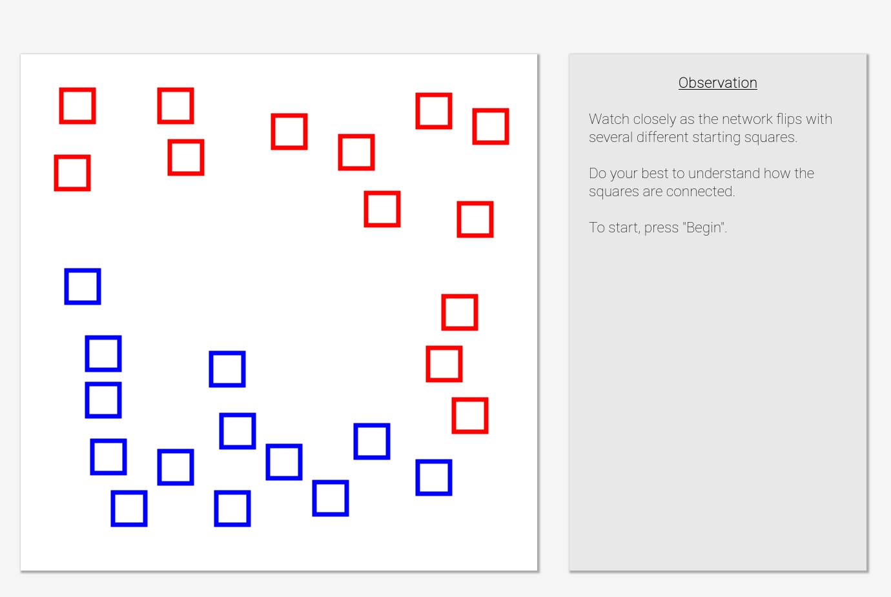

# RAIL Lab at Georgia Tech's Network Inference Cognitive Test

Maintained by Jack Kolb (kolb@gatech.edu), copyright (C) 2021 RAIL Lab @ Georgia Tech

### Overview ###

This test quantifies a user's network inference cognitive trait, or their ability to learn and apply an understanding of a hidden network connecting nodes. The user plays a series of puzzles where they are given a set of nodes, they watch the network propagate color from several example starting nodes, and then they identify the starting node to propagate color through the network in the least time steps. This requires them to understand how nodes are connected to solve each puzzle.

We have previous found a link between performance in this test and performance in robot tasks involving a user's understanding of networked robots.

### How to Use ###

If you are looking to adapt this pre-test for your own work, look into the adjustments below. We ask that you cite this GitHub repository if you use, modify, or create derivatives of this codebase for your own work.

Recommended adjustments:
1. In **index.html**, make sure you are importing the CSS/JS scripts correctly as per your webserver, an example is provided for Flask.
2. In **index.html**, several game parameters are followed by a comment starting with `//SET THIS`, change these as you see fit.
3. In **puzzles.js**, you can add additional functions to create more puzzles, just copy/paste/modify the `generatePuzzle1()` function. Make sure to add these functions in index.html (the networks.puzzles parameter) so they appear in the pre-test.
4. In **utility.js**, you can change the logging function to whatever suits your needs. We used POST requests to our webserver. You may want to go through the JS files if your logging system varies substantially from ours.

Optional adjustments:
1. In **Node.js**, you can change the node (square/triangle) height and stroke width in Node.constructor().
2. In **sidePanel.js**, you can change the side panel contents at the various game stages (introduction, observation, response, end puzzle, end game).

### Demonstration Image/Video ###

Click below to see a demonstration video (will open in YouTube):

