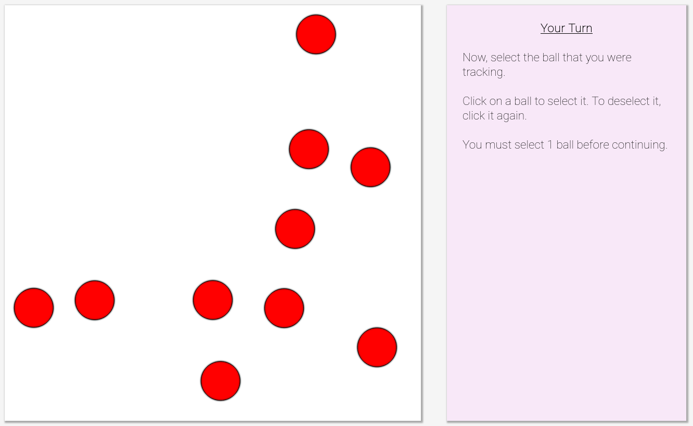

# RAIL Lab at Georgia Tech's Object Tracking Cognitive Test

Maintained by Jack Kolb (kolb@gatech.edu), copyright (C) 2021 RAIL Lab @ Georgia Tech

### Overview ###

This test quantifies a user's object tracking cognitive trait, or their ability to track multiple objects simultaneously. The user is given a set of ten red balls, and they watch the balls move and bounce around the screen for 20 seconds. The user then identifies the tracked balls and moves on to the next round, tracking more balls.

This cognitive test is based on the [Multiple Object Tracking test](https://en.wikipedia.org/wiki/Multiple_object_tracking).

### How to Use ###

If you are looking to adapt this cognitive test for your own work, look into the adjustments below. We ask that you cite this GitHub repository if you use, modify, or create derivatives of this codebase for your own work.

Recommended adjustments:
1. In **index.html**, make sure you are importing the CSS/JS scripts correctly as per your webserver, an example is provided for Flask.
2. In **index.html**, several game parameters are followed by a comment starting with `//SET THIS`, change these as you see fit.
4. In **utility.js**, you can change the logging function to whatever suits your needs. We used POST requests to our webserver. You may want to go through the JS files if you change the logging format.

Optional adjustments:
1. In **Ball.js**, you can change the ball height and outline width in Ball.constructor(), and the ball speed in Ball.initSpeed().
2. In **sidePanel.js**, you can change the side panel contents at the various game stages (introduction, observation, response, end game), or add more logging at those points.

### Demonstration Image ###

